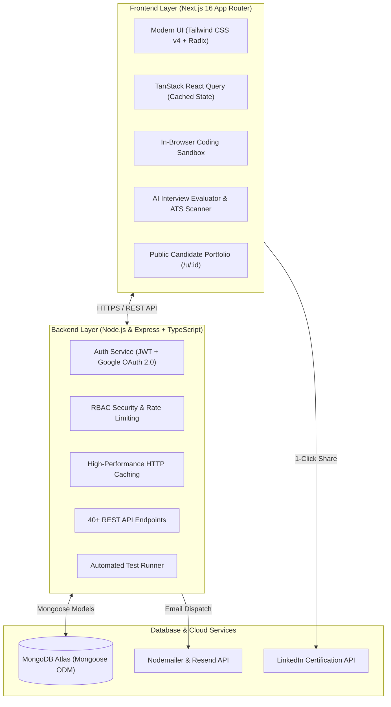
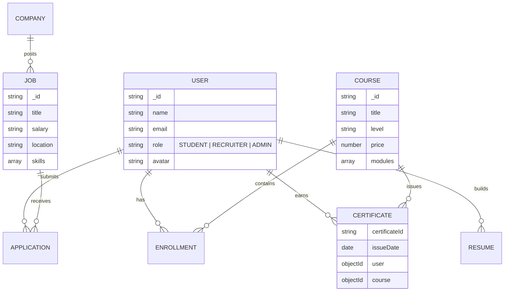

<div align="center">

# 🎓 SkillForge — Full-Stack Learning & Career Recruitment Platform

### *Empowering Students, Connecting Recruiters, Accelerating Tech Careers*

[](https://nextjs.org/)
[](https://react.dev/)
[](https://www.typescriptlang.org/)
[](https://nodejs.org/)
[](https://expressjs.com/)
[](https://www.mongodb.com/)
[](https://tailwindcss.com/)
[](https://www.docker.com/)

[](https://job-student-task.vercel.app)
[](https://job-student-task.onrender.com)
[](https://job-student-task.vercel.app/api-docs)
[](LICENSE)

</div>

---

## 🌐 Live Deployments & API Explorer

- **Production Client (Next.js 16):** [https://job-student-task.vercel.app](https://job-student-task.vercel.app)
- **Production Server (Express API):** [https://job-student-task.onrender.com](https://job-student-task.onrender.com)
- **Interactive REST API Reference:** [https://job-student-task.vercel.app/api-docs](https://job-student-task.vercel.app/api-docs)
- **System Health Check:** [https://job-student-task.onrender.com/api/health](https://job-student-task.onrender.com/api/health)
- **GitHub Repository:** [https://github.com/sojibahmedshorif25-ai/JOB-STUDENT-TASK](https://github.com/sojibahmedshorif25-ai/JOB-STUDENT-TASK)

---

## 🏗️ System Architecture



---

## 👥 Demo Accounts & Role-Based Access Control (RBAC)

Seed credentials:

| Role | Demo Email | Access Capabilities |
|:---|:---|:---|
| **Admin** | `sojibahmedshorif25@gmail.com` | Full platform control, user management, metrics, course oversight (Owner account). |
| **Student** | `sojib@student.dev` | Enroll courses, video player, quizzes, AI mock interviews, ATS resume builder, certificates, job applications (`password123`). |
| **Recruiter** | `recruiter1@company.dev` | Post jobs, candidate pipelines, interview scheduling, applicant management (`password123`). |

> **Real Google Login:** Anyone with a real Google/Gmail account can sign in with 1-click via the "Continue with Google" button!

---

## ✨ Enterprise Feature Highlights

### 🎓 1. Learning & Certification Engine
- **Curriculum Player:** Video lessons, module progress tracking, markdown notes, and auto-progression.
- **Automated Quiz Engine:** Real-time scoring and instant pass/fail validation.
- **Cryptographic Certificate Verification:** Public verify endpoint (`/verify/:id`) with authentic credential ID and tamper-proof verification.
- **1-Click LinkedIn Certificate Share:** Instant addition of verified credentials into LinkedIn candidate profiles with pre-filled certification metadata.
- **Print & PDF Export:** Clean print-media layout for certificate printing.

### 🤖 2. AI Career & Interview Tools
- **AI Mock Interview Simulation:** Timed technical mock interviews with algorithmic scoring across Accuracy, Terminology, Depth, and Clarity.
- **AI ATS Resume Scanner & Optimizer:** Live ATS compatibility index (0-100%), missing keyword highlights, and impact action-verb suggestions.
- **Interactive Coding Sandbox:** Live in-browser JavaScript code editor with real-time test-case assertion execution and console output capture.
- **SkillBot AI Assistant:** Floating interactive AI tutor across the platform.

### 💼 3. Recruitment & Job Pipeline
- **Job Board:** Advanced filtering (remote, full-time, salary ranges, required skill tags).
- **Recruiter Dashboard:** Post jobs, view candidate pipeline, review resumes, and track candidate status (Applied, Interviewing, Offered, Rejected).
- **Public Developer Portfolio (`/u/:id`):** Sharable candidate profile showcasing verified certificates, projects, and direct "Hire Me" contact modal.

---

## 🗄️ Database Schema & Entity Relationships



---

## 🚀 Quickstart & Local Development

### Option A: 1-Command Startup with Docker Compose
```bash
docker-compose up --build
```
- Client running on: `http://localhost:3000`
- Server API running on: `http://localhost:5000`
- MongoDB running on: `mongodb://localhost:27017`

---

### Option B: Standard NPM Setup

#### 1. Backend Server Setup (Port 5000)
```bash
cd server
npm install
copy .env.example .env     # Configure MONGODB_URI and JWT_SECRET
npm run seed              # Seed initial courses, jobs, and demo users
npm run dev               # Starts tsx watch server
```

#### 2. Frontend Client Setup (Port 3000)
```bash
cd client
npm install
copy .env.example .env.local
npm run dev               # Starts Next.js Turbopack dev server
```

---

## 🧪 Automated Testing & Quality Assurance

```bash
# Run backend automated integration tests
cd server
npm test

# Run TypeScript typechecks
cd server && npm run typecheck
cd client && npm run build
```

---

## 💼 CV & Interview Guide

For resume bullet points, quantifiable metrics, and answers to high-frequency technical interview questions about this project, refer to **[`CV_PORTFOLIO_GUIDE.md`](./CV_PORTFOLIO_GUIDE.md)**.

---

## 📄 License

This project is licensed under the [MIT License](./LICENSE). Built by **Sojib Ahmed Shorif**.
